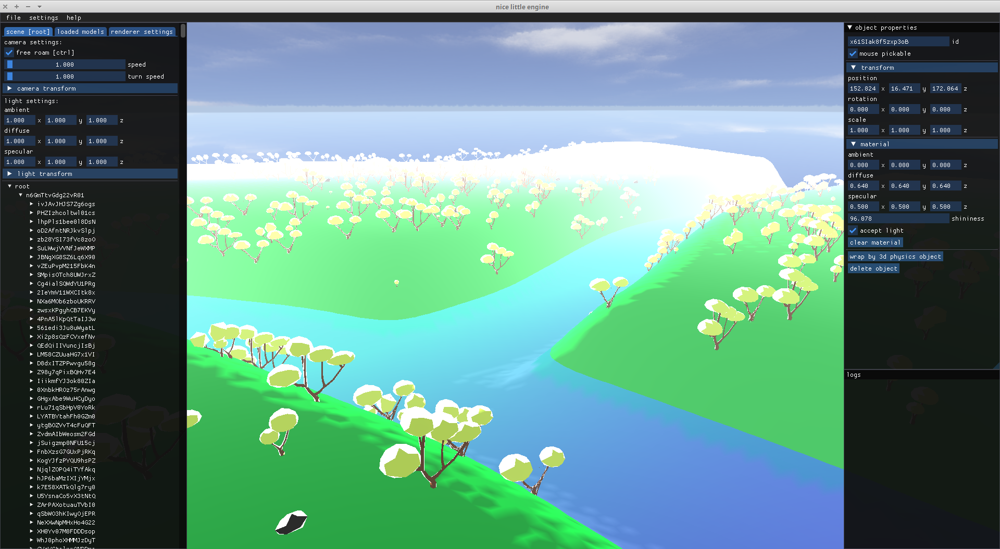

## nice little engine

### Experimental graphics and physics engine [](https://opensource.org/licenses/MIT)

 

Summary:

All classes will be Doxygen style commented, I avoid doing that now, because many things I did need refactoring, I don't want to document all of my mistakes :')
```
- Object3D: Every object in a scene (including a scene) inherits from Object3D
  │
  ├── RenderObject3D: Rendered by Renderer3D
  │   │
  │   ├── MeshInstance (see: Mesh)
  │   │   │
  │   │   ├── Sky: A skybox cube with distance fog feature.
  │   │   │
  │   │   └── TerrainInstance
  │   │
  │   └── MultiMeshInstance (see: MultiMesh) Any loaded model's instance is a MultiMeshInstance.
  │
  ├── PhysicsObject3D: Limited to have one child that being a RenderObject3D. Passed 
  │                    to the PhysicsEngine. Its child is rendered by Renderer3D.
  │
  ├── Scene: Entry point of an Object3D tree. It has a default Sky, Light and a Camera.
  │
  ├── Light: Directional light with ambient, diffuse and specular.
  │
  └── Camera: Camera implementation with free roam option.

- Renderer3D: Renders a (3D) Scene.

- PhysicsEngine: Processes registered PhysicsObject3Ds. It's so simple, not done yet.

- Shader: Shader implementation. Can be loaded from memory or file.

- Texture: Not very detailed (but working) texture implementation. Can be loaded from memory or file.

- InputHandler: Input handler class that emits signals on mouse and keyboard events. Needs improvement.

- Window: Window class implemented upon GLFW.

- Nle: Main class that initializes and destroys window, renderer, physics engine and defaults. It's essentially our main application.
```

 # TODO list by difficulties 
  - Hadoken
    - editor (code needs a mass refactor and cleanup)
    - gltf & glb loading
    - ~~scene saving and loading~~
    - point light
    - ~~mouse ray for 3d interaction~~
    - default shaders need tidying up
  - Shoryuken
    - instanced drawing (that works with physics engine)
    - point light (and multiple lights)
    - shadows
    - ~~materials need more than specular~~
  - Tatsumaki Senpukyaku
    - collision system that does not suck
    - skeletal animation system
    - a game made with *nice little engine* that works


---
hasan karaman - https://hasankaraman.dev - 2023
